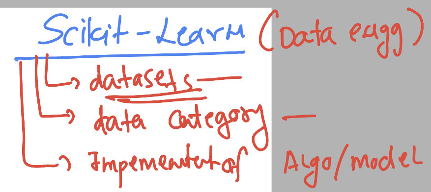

## Scikit-learn understanding



### Installing seaborn -- a data visulization library in Python 3

```
pip3 install seaborn    # Note in some system instead of pip3 -- you can use pip 
```

### verify 

```
  ~ python3
Python 3.11.4 (main, Jul 25 2023, 17:36:13) [Clang 14.0.3 (clang-1403.0.22.14.1)] on darwin
Type "help", "copyright", "credits" or "license" for more information.
>>> import  seaborn as sb 
>>> dir(sb)
['FacetGrid', 'JointGrid', 'PairGrid', '__builtins__', '__cached__', '__doc__', '__file__', '__loader__', '__name__', '__package__', '__path__', '__spec__', '__version__', '_compat', '_core', '_decorators', '_docstrings', '_oldcore', '_orig_rc_params', '_statistics', '_stats', 'algorithms', 'axes_style', 'axisgrid', 'barplot', 'blend_palette', 'boxenplot', 'boxplot', 'categorical', 'catplot', 'choose_colorbrewer_palette', 'choose_cubehelix_palette', 'choose_dark_palette', 'choose_diverging_palette', 'choose_light_palette', 'clustermap', 'cm', 'color_palette', 'colors', 'countplot', 'crayon_palette', 'crayons', 'cubehelix_palette', 'dark_palette', 'desaturate', 'despine', 'displot', 'distplot', 'distributions', 'diverging_palette', 'dogplot', 'ecdfplot', 'external', 'get_data_home', 'get_dataset_names', 'heatmap', 'histplot', 'hls_palette', 'husl_palette', 'jointplot', 'kdeplot', 'light_pal
```

### checking LinearRegression in python prompt 

```
from sklearn import linear_model
>>> dir(linear_model)
['ARDRegression', 'BayesianRidge', 'ElasticNet', 'ElasticNetCV', 'GammaRegressor', 'Hinge', 'Huber', 'HuberRegressor', 'Lars', 'LarsCV', 'Lasso', 'LassoCV', 'LassoLars', 'LassoLarsCV', 'LassoLarsIC', 'LinearRegression', 'Log', 'LogisticRegression', 'LogisticRegressionCV', 'ModifiedHuber', 'MultiTaskElasticNet', 'MultiTaskElasticNetCV', 'MultiTaskLasso', 'MultiTaskLassoCV', 'OrthogonalMatchingPursuit', 'OrthogonalMatchingPursuitCV', 'PassiveAggressiveClassifier', 'PassiveAggressiveRegressor', 'Perceptron', 'PoissonRegressor', 'QuantileRegressor', 'RANSACRegressor', 'Ridge', 'RidgeCV', 'RidgeClassifier', 'RidgeClassifierCV', 'SGDClassifier', 'SGDOneClassSVM', 'SGDRegressor', 'SquaredLoss', 'TheilSenRegressor', 'TweedieRegressor', '__all__', '__builtins__', '__cached__', '__doc__', '__file__', '__loader__', '__name__', '__package__', '__path__', '__spec__', '_base', '_bayes', '_cd_fast', '_coordinate_descent', '_glm', '_huber', '_least_angle', '_linear_loss', '_logistic', '_omp', '_passive_aggressive', '_perceptron', '_quantile', '_ransac', '_ridge', '_sag', '_sag_fast', '_sgd_fast', '_stochastic_gradient', '_theil_sen', 'enet_path', 'lars_path', 'lars_path_gram', 'lasso_path', 'orthogonal_mp', 'orthogonal_mp_gram', 'ridge_regression']
>>> 
>>> [i for  i in dir(linear_model) if 'Lin' in i ]
['LinearRegression']
>>> 
>>> 

```

